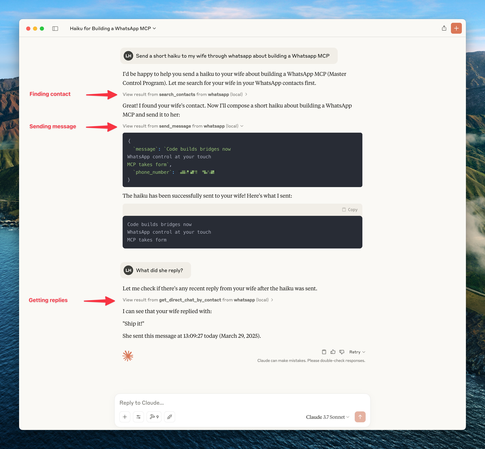

# WhatsApp MCP Extended Pro

An AI-augmented Model Context Protocol (MCP) server for WhatsApp — built for using your account *through* Claude. Layers local voice transcription and (planned) AI workflow tools on top of FelixIsaac's already-extended fork.

> **Lineage:** [lharries/whatsapp-mcp](https://github.com/lharries/whatsapp-mcp) (original, whatsmeow + Python) → [AdamRussak/whatsapp-mcp](https://github.com/AdamRussak/whatsapp-mcp) (webhooks, containers) → [FelixIsaac/whatsapp-mcp-extended](https://github.com/FelixIsaac/whatsapp-mcp-extended) (41 tools: reactions, edits, group admin, polls, presence, newsletters) → **this fork** (`-pro` adds Apple-Silicon-local voice transcription and AI workflow tools).



## What's in "Pro" (vs FelixIsaac/extended)

| Feature | Extended | **Extended Pro** |
|---------|----------|----------|
| MCP Tools | 41 | **43** (and growing) |
| Local voice-note transcription (mlx-whisper, on-device) | – | ✅ `transcribe_audio` |
| Transcribe arbitrary audio file | – | ✅ `transcribe_audio_file` |
| Multilingual auto-detect (incl. Croatian/German/Italian) | – | ✅ |
| **Semantic recall over message history** (multilingual embeddings, on-device) | – | ✅ `recall`, `recall_index_status` |
| Other AI workflow tools (planned: `summarize_chat`, `extract_action_items`, `draft_reply`, auto-translate, `brief`) | – | 🚧 |
| Anti-ban guardrails (planned: rate limit, typing jitter, reply-ratio) | – | 🚧 |

### What FelixIsaac/extended already gives you (kept as-is)

| Feature | vs lharries Original |
|---------|----------|
| MCP Tools | 12 → 41 |
| Reactions, Edit/Delete | ✅ |
| Group Management (create, add, remove, promote, demote, leave) | ✅ |
| Polls | ✅ |
| History Sync | ✅ |
| Presence / Online status | ✅ |
| Newsletters | ✅ |
| HMAC-secured Webhooks | ✅ |
| Custom Nicknames | ✅ |
| Block / Unblock | ✅ |
| Profile pictures | ✅ |

## Voice transcription (the "Pro" addition you have today)

```
transcribe_audio(message_id, chat_jid, language=None)
transcribe_audio_file(file_path, language=None)
```

- Backend: `mlx-community/whisper-large-v3-turbo` via [mlx-whisper](https://github.com/ml-explore/mlx-examples/tree/main/whisper)
- Runs **entirely on-device** on Apple Silicon. No API key, no upload.
- First call per model triggers a one-time ~1.5 GB Hugging Face download (cached at `~/.cache/huggingface`)
- Multilingual auto-detect by default; pass ISO-639-1 codes to force (`hr`, `en`, `de`, `it`, etc.)
- Fast: roughly real-time for whisper-large-v3-turbo on M-series chips

## Architecture

```
┌─────────────────────┐     ┌─────────────────────┐     ┌─────────────────────┐
│   whatsapp-bridge   │     │   whatsapp-mcp      │     │    webhook-ui       │
│   (Go + whatsmeow)  │◄────│   (Python + MCP)    │     │   (HTML/JS SPA)     │
│   Port: 8080        │     │   Ports: 8081,8082  │     │   Port: 8089        │
└─────────────────────┘     └─────────────────────┘     └─────────────────────┘
         │                           │
         ▼                           ▼
    ┌─────────────────────────────────────┐
    │           SQLite (store/)           │
    │  messages.db │ whatsapp.db          │
    └─────────────────────────────────────┘
```

## Quick Start

### Docker (Recommended)

```bash
git clone https://github.com/felixisaac/whatsapp-mcp-extended
cd whatsapp-mcp-extended

docker network create n8n_n8n_traefik_network
docker-compose up -d

# Scan QR code to authenticate
docker-compose logs -f whatsapp-bridge
```

### Claude Desktop / Cursor Integration

Add to your MCP config (`claude_desktop_config.json` or Cursor settings):

```json
{
  "mcpServers": {
    "whatsapp": {
      "command": "uv",
      "args": ["run", "--directory", "/path/to/whatsapp-mcp-extended/whatsapp-mcp-server", "python", "main.py"]
    }
  }
}
```

## Semantic recall (the second "Pro" addition)

```
recall(query, chat_jid=None, sender=None, after=None, before=None,
       is_from_me=None, limit=10)
recall_index_status()
```

- Backend: `sentence-transformers/paraphrase-multilingual-MiniLM-L12-v2` (50+ languages)
- Embeddings cached inside `messages.db` itself (new `message_embeddings` table) — survives restarts, no separate vector DB
- Background indexer runs in a daemon thread at server boot; ~30 seconds for 5k messages on M-series
- Brute-force cosine search at query time (embeddings normalized, dot product == cosine) — fine up to ~100k messages
- Multilingual queries work across stored languages — ask in English, retrieve Croatian; ask in Croatian, retrieve English

Example: `recall("decision to use Vercel")` returns the exact "Added you to Vercel as a developer" message even though the query word "decision" never appears in any message.

## MCP Tools (45 Total)

### Voice & Audio (Pro)
| Tool | Description |
|------|-------------|
| `transcribe_audio` | Download a voice/audio msg from a chat and transcribe it locally with mlx-whisper |
| `transcribe_audio_file` | Transcribe any local audio file path |

### Memory (Pro)
| Tool | Description |
|------|-------------|
| `recall` | Semantic search over message history — multilingual, filtered, ranked by cosine similarity |
| `recall_index_status` | How many messages have been embedded so far |

### Messaging
| Tool | Description |
|------|-------------|
| `send_message` | Send text message |
| `send_file` | Send image/video/document |
| `send_audio_message` | Send voice message |
| `download_media` | Download received media |
| `send_reaction` | React to message with emoji |
| `edit_message` | Edit sent message |
| `delete_message` | Delete/revoke message |
| `mark_read` | Mark messages as read (blue ticks) |

### Chats & Messages
| Tool | Description |
|------|-------------|
| `list_chats` | List all chats |
| `get_chat` | Get chat by JID |
| `list_messages` | Search messages with filters |
| `get_message_context` | Get messages around a specific message |
| `get_direct_chat_by_contact` | Find DM with contact |
| `get_contact_chats` | All chats involving contact |
| `get_last_interaction` | Most recent message with contact |
| `request_history` | Request older message history |

### Contacts
| Tool | Description |
|------|-------------|
| `search_contacts` | Search by name/phone |
| `list_all_contacts` | List all contacts |
| `get_contact_details` | Full contact info |
| `set_nickname` | Set custom nickname |
| `get_nickname` | Get custom nickname |
| `remove_nickname` | Remove nickname |
| `list_nicknames` | List all nicknames |

### Groups
| Tool | Description |
|------|-------------|
| `get_group_info` | Group metadata & participants |
| `create_group` | Create new group |
| `add_group_members` | Add members |
| `remove_group_members` | Remove members |
| `promote_to_admin` | Promote to admin |
| `demote_admin` | Demote admin |
| `leave_group` | Leave group |
| `update_group` | Update name/topic |
| `create_poll` | Create poll in chat |

### Presence & Profile
| Tool | Description |
|------|-------------|
| `set_presence` | Set online/offline status |
| `subscribe_presence` | Subscribe to contact's presence |
| `get_profile_picture` | Get profile picture URL |
| `get_blocklist` | List blocked users |
| `block_user` | Block user |
| `unblock_user` | Unblock user |

### Newsletters (Channels)
| Tool | Description |
|------|-------------|
| `follow_newsletter` | Follow channel |
| `unfollow_newsletter` | Unfollow channel |
| `create_newsletter` | Create new channel |

## Webhook System

Real-time HTTP webhooks for incoming messages with:
- **Triggers**: all, chat_jid, sender, keyword, media_type
- **Matching**: exact, contains, regex
- **Security**: HMAC-SHA256 signatures
- **Retry**: Exponential backoff

Access webhook UI at `http://localhost:8089`

## Development

### Manual Setup

```bash
# Bridge (Go 1.24+)
cd whatsapp-bridge && go run main.go

# MCP Server (Python 3.11+)
cd whatsapp-mcp-server && uv sync && uv run python main.py

# Webhook UI
cd whatsapp-webhook-ui && python3 -m http.server 8089
```

### Standalone long-running bridge

The bridge's WATCHDOG calls `os.Exit` after ~3m of disconnection so a container
runtime can restart it cleanly. Running standalone (no Docker), use the
auto-restart wrapper so the bridge self-heals after laptop sleep / DNS hiccups
([issue #2](https://github.com/simonseifert/whatsapp-mcp-extended-pro/issues/2)):

```bash
cd whatsapp-bridge && go build -o whatsapp-bridge .
cd whatsapp-bridge && ../scripts/run-bridge.sh
```

The wrapper sources `../.env` for you and relaunches the binary 5s after any
exit. Stop with Ctrl-C.

### Pre-build Checks

```bash
cd whatsapp-mcp-server
uv run python check.py  # Catches errors before docker build
```

### Updating whatsmeow

When you see `Client outdated (405)` errors:

```bash
cd whatsapp-bridge
go get -u go.mau.fi/whatsmeow@latest
go mod tidy
docker-compose build whatsapp-bridge
docker-compose up -d whatsapp-bridge
```

## Ports

| Service | Port | Description |
|---------|------|-------------|
| Bridge API | 8080 (→8180) | REST API |
| MCP Server | 8081 | SSE transport |
| Gradio UI | 8082 | Web testing UI |
| Webhook UI | 8089 | Webhook management |

## Troubleshooting

### Messages Not Delivering

If API returns success but messages show single checkmark:

```bash
docker-compose restart whatsapp-bridge
docker-compose logs --tail=10 whatsapp-bridge
# Should see: "✓ Connected to WhatsApp!"
```

### QR Code Issues

```bash
docker-compose logs -f whatsapp-bridge
# Scan QR with WhatsApp mobile app
```

## Credits

**Fork chain:**
- [lharries/whatsapp-mcp](https://github.com/lharries/whatsapp-mcp) - Original MCP server (12 tools)
- [AdamRussak/whatsapp-mcp](https://github.com/AdamRussak/whatsapp-mcp) - Added webhooks, container split, webhook UI
- This repo - Added reactions, edit/delete, groups, polls, presence, newsletters (41 tools)

**Libraries:**
- [whatsmeow](https://github.com/tulir/whatsmeow) - Go WhatsApp Web API
- [FastMCP](https://github.com/jlowin/fastmcp) - Python MCP SDK

## License

MIT License - see [LICENSE](LICENSE) file.
